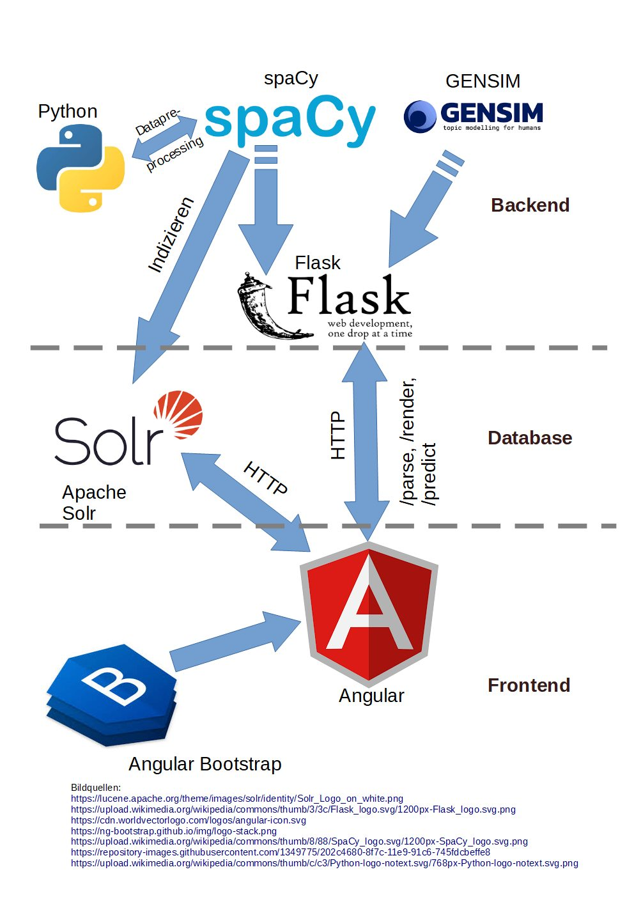

# NLP-SearchEngine

A NLP-featured Search-Engine for german legal cases using the [openlegaldata-dataset](https://de.openlegaldata.io/). Based on spaCy, nltk, gensim, textblob-de and Solr this project offers the user to search for legal cases based on part of speech (POS) tags and to display the dependency graphs aswell as sentiment for the sentences. The user input is supported by suggesting the next words based on predictions from word2vec and n-grams. Furthermore there is an experimental feature that uses an Naive Bayes Classifier to predict the outcome of the lawsuit.

